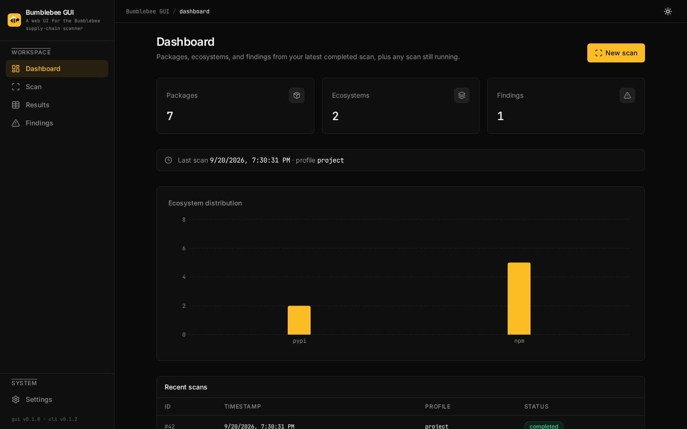
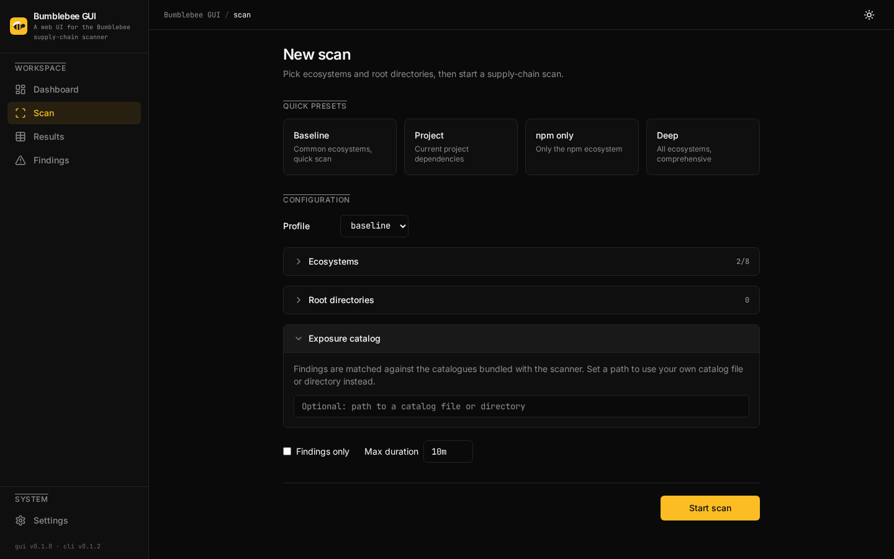
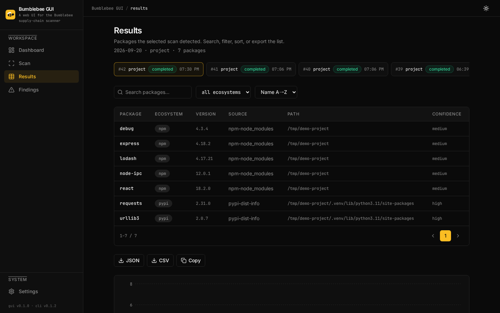
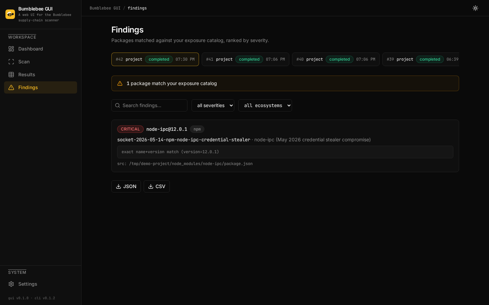
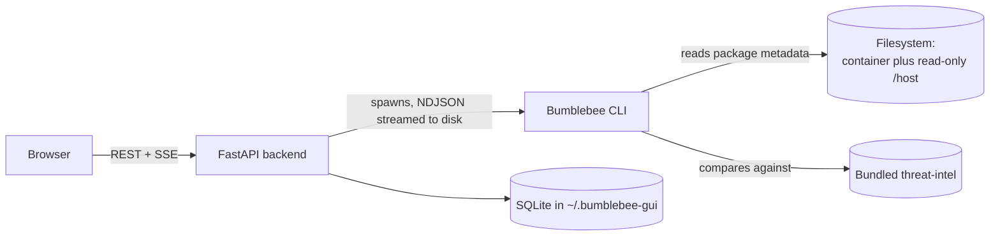
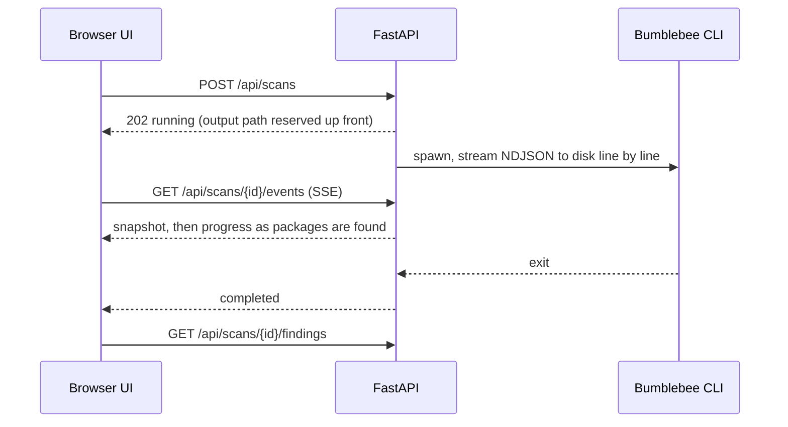

# Bumblebee GUI

A web interface for [Bumblebee](https://github.com/perplexityai/bumblebee), the open source supply chain
security scanner from Perplexity AI.

Bumblebee walks a filesystem, reads package metadata across a dozen ecosystems, and reports anything that
matches a published compromise. It is a CLI, which suits some people and not others. Bumblebee GUI wraps it in
a web app: point it at a directory, run a scan, watch progress stream in, and read the result as a table you
can filter, sort and export.



## What it does

- Runs scans in the background and streams live progress to the browser over Server-Sent Events, so nothing
  blocks while a big tree is walked
- Compares every package it finds against the bundled exposure catalogues and reports matches by severity
- Filters, searches and sorts results, and exports them as JSON or CSV
- Keeps a scan history you can revisit, and cancels a running scan on request
- Scans a read-only mount of a host directory, without handing the container anything else
- Ships light and dark themes

## Quick start

You need Docker and Docker Compose.

```bash
git clone https://github.com/ruangraung/bumblebee-gui.git
cd bumblebee-gui
docker compose up -d
```

Then open <http://localhost:5173>. The API listens on <http://localhost:8001> and documents itself at
<http://localhost:8001/docs>.

### Your first scan

1. Open the **Scan** page.
2. Pick a profile (`baseline`, `project` or `deep`) and any ecosystems you care about.
3. Press **Start Scan**. The scan runs server side and the page fills in as packages are found.
4. Packages and any matching findings appear when it finishes.

### Scanning a directory on your machine

The backend runs in a container, so by default a scan sees only the container's own filesystem. To scan a
directory that lives on the host, mount it read-only at `/host`:

```bash
BUMBLEBEE_HOST_DIR=/home/you/projects \
  docker compose -f docker-compose.yml -f docker-compose.host-scan.yml up -d backend
```

Then use `/host`, or any path under it, as the scan root. The mount is read-only, so nothing in the container
can change what the scanner sees. Everything under that directory does become readable by the backend, which
listens on localhost only, so mount the narrowest directory that answers your question.

## Exposure catalogues

A scanner can only report what it has something to compare against. Bumblebee GUI ships the catalogues and
points the scanner at them, so a scan reports real matches without any setup.

The catalogues come from upstream's `threat_intel` set, pinned at tag `v0.1.2`: **eleven catalogues, 1,072
entries**, covering npm, pypi, rubygems, go, packagist and editor-extension. Each one describes a real
published campaign, with its source report attached.

| What the scan request says | What the scan compares against |
|---|---|
| A path | That catalog file or directory |
| An empty string | Nothing, which is how you ask for a pure inventory scan |
| Nothing at all | The bundled catalogues |

Every file's sha256 is pinned in [`threat-intel.manifest`](threat-intel.manifest) and verified while the image
is built, because this data decides whether a package gets reported as malicious. The catalogues are a
snapshot rather than a feed: a new campaign reaches the image when the pinned commit is bumped, which shows up
as a reviewable change to the digests.

To use your own, put a path in the scan form's exposure catalogue field. A file or a directory of `.json`
catalogues both work.

## Screenshots

| | |
|---|---|
|  |  |
| Scan configuration | Results |
|  |  |
| Dashboard | Findings |

These come from a demo scan of a throwaway project built to contain one package that a published campaign
compromised. No real environment appears in them.

## Architecture



Three processes, and the boundaries between them are the interesting part. The browser never talks to the
scanner; the backend never parses package metadata itself. The CLI does the walking and emits NDJSON, the
backend turns that into records and serves them, and the browser renders what it is given.

## Scan lifecycle



Cancelling works the same way in reverse: `DELETE /api/scans/{id}` cancels the task, kills the subprocess,
and removes the partial output.

## API

| Method | Endpoint | Description |
|--------|----------|-------------|
| `GET` | `/api/health` | Health check |
| `POST` | `/api/scans` | Submit a scan, returns `202` with a `running` record |
| `GET` | `/api/scans` | List recent scans |
| `GET` | `/api/scans/{id}` | Scan details, including live `packages_found` while running |
| `GET` | `/api/scans/{id}/events` | SSE stream: `snapshot`, `progress`, `completed` / `failed` / `cancelled` |
| `DELETE` | `/api/scans/{id}` | Delete a scan, cancelling it first if it is still running |
| `GET` | `/api/scans/{id}/packages` | Packages from a completed scan |
| `GET` | `/api/scans/{id}/findings` | Catalogue matches from a completed scan |
| `GET` | `/api/scans/{id}/export` | Export scan data as JSON or CSV |

## Scan profiles

| Profile | Use case | Scans |
|---------|----------|-------|
| `baseline` | Daily lightweight inventory | Global package roots, toolchains, extensions |
| `project` | Project workspace inventory | Configured dev directories |
| `deep` | Incident response | Explicit root paths, full home directory |

## What has actually been tested

Honest table, because a README that claims more than it has run is worse than a short one.

| Path | Status |
|---|---|
| Linux with Docker Compose | **Verified.** Scans of a 780 package tree, catalogue matching against a compromised fixture, the full test suite and all five CI gates |
| macOS with Docker Compose | **Not tested by us yet.** Expected to work, since the scanner runs inside the Linux container |
| Windows | **No native path.** Upstream publishes no Windows build of the scanner. Docker Desktop runs the Linux container, so it may well work, but nothing has been checked there |
| Native install without Docker | A development path only. Nothing has been verified and `install.sh` does not produce a working setup yet |

If you try a path that is not verified, an issue describing what happened is genuinely useful.

## Development

Prerequisites: Python 3.11+, Node 22+, Docker (recommended).

### With Docker

```bash
docker compose up -d
docker compose logs -f
docker compose down
```

### Without Docker

```bash
cd backend
python -m venv venv && source venv/bin/activate
pip install -r requirements-dev.txt
uvicorn bumblebee_gui.main:app --reload --port 8000

# in another terminal
cd frontend
npm install
npm run dev
```

The scanner binary is expected at `/usr/local/bin/bumblebee`, overridable with `BUMBLEBEE_BINARY`.

## Testing

```bash
cd backend && python -m pytest tests -q
cd frontend && npm run test && npm run build
```

The backend suite covers command building, NDJSON parsing, record mapping, the subprocess streaming and
cancellation path, and the async scan lifecycle. The frontend suite covers the pure logic in `src/lib`, which
is where export encoding, filtering, sorting and date handling live.

### CI gates

Every push and pull request runs five:

1. **Socket** supply-chain scan
2. **Gitleaks** secret scan
3. **Dependency audits**, `pip-audit` and `npm audit`, both hard gates
4. **Backend and frontend**: pytest, vitest, `tsc` and the production build
5. **CodeScene Code Health**, which blocks hotspots from declining and new code from arriving unhealthy

## Data storage

Scan data lives in `~/.bumblebee-gui/`, overridable with `BUMBLEBEE_DATA_DIR`:

```
~/.bumblebee-gui/
|-- bumblebee-gui.db
`-- scans/
    `-- 2026-05-27_baseline_170000.ndjson
```

## Security

- **Local by default.** The API binds to localhost and makes no network calls at runtime.
- **Read-only scanning.** The scanner reads metadata and never writes to the tree it is scanning.
- **Nothing baked in blindly.** The bundled threat intel is pinned by commit and verified per file during the
  image build, and the CLI binary is pinned by version and sha256 for the same reason.
- **No credentials in the code.** Configuration comes from the environment.
- **Five gates on every change**, listed above.

## Contributing

See [CONTRIBUTING.md](CONTRIBUTING.md). Issues and pull requests are welcome, including the
"I tried the macOS path and here is what broke" kind.

## AI-assisted development

This project is built with AI assistance, and changes arrive as pull requests that a human reviews before they
merge. Saying so seems better than leaving a reader to guess.

## License

Apache-2.0. See [LICENSE](LICENSE).

The Docker image redistributes Perplexity's compiled Bumblebee CLI, which is also Apache-2.0, and the exposure
catalogues are fetched from the same project at build time. Attribution and the exact versions are recorded in
[THIRD-PARTY-NOTICES.md](THIRD-PARTY-NOTICES.md).

## Acknowledgments

- [Bumblebee](https://github.com/perplexityai/bumblebee) by Perplexity AI, the scanner this wraps and the
  source of the exposure catalogues
- [shadcn/ui](https://ui.shadcn.com/) for the components
- [FastAPI](https://fastapi.tiangolo.com/) for the API framework
- [React](https://react.dev/) for the frontend
